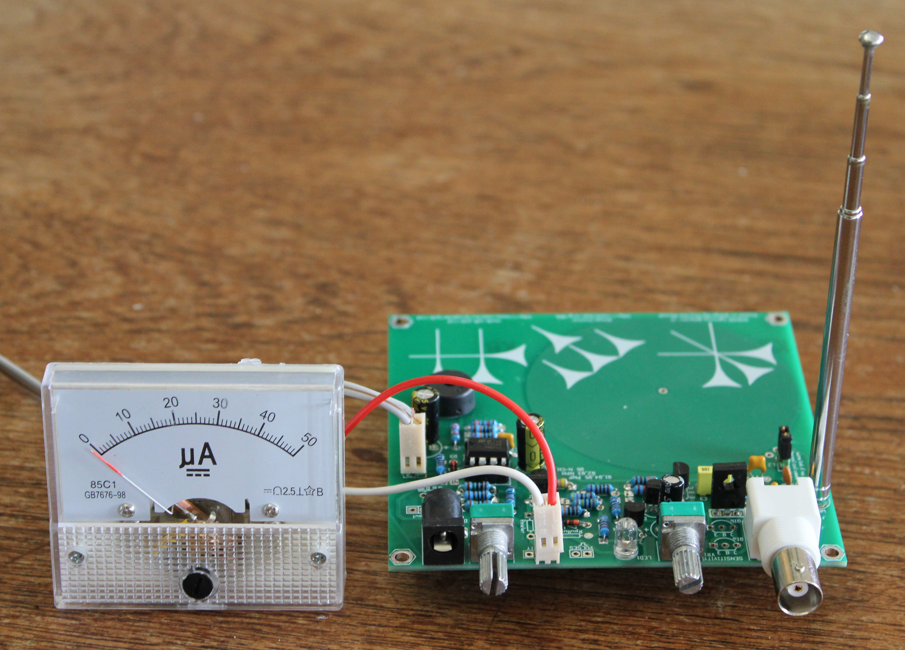
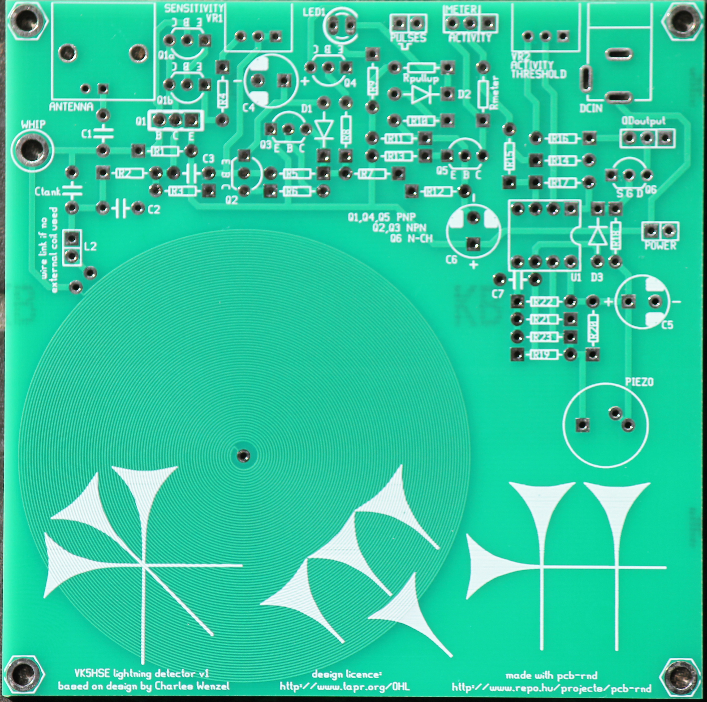
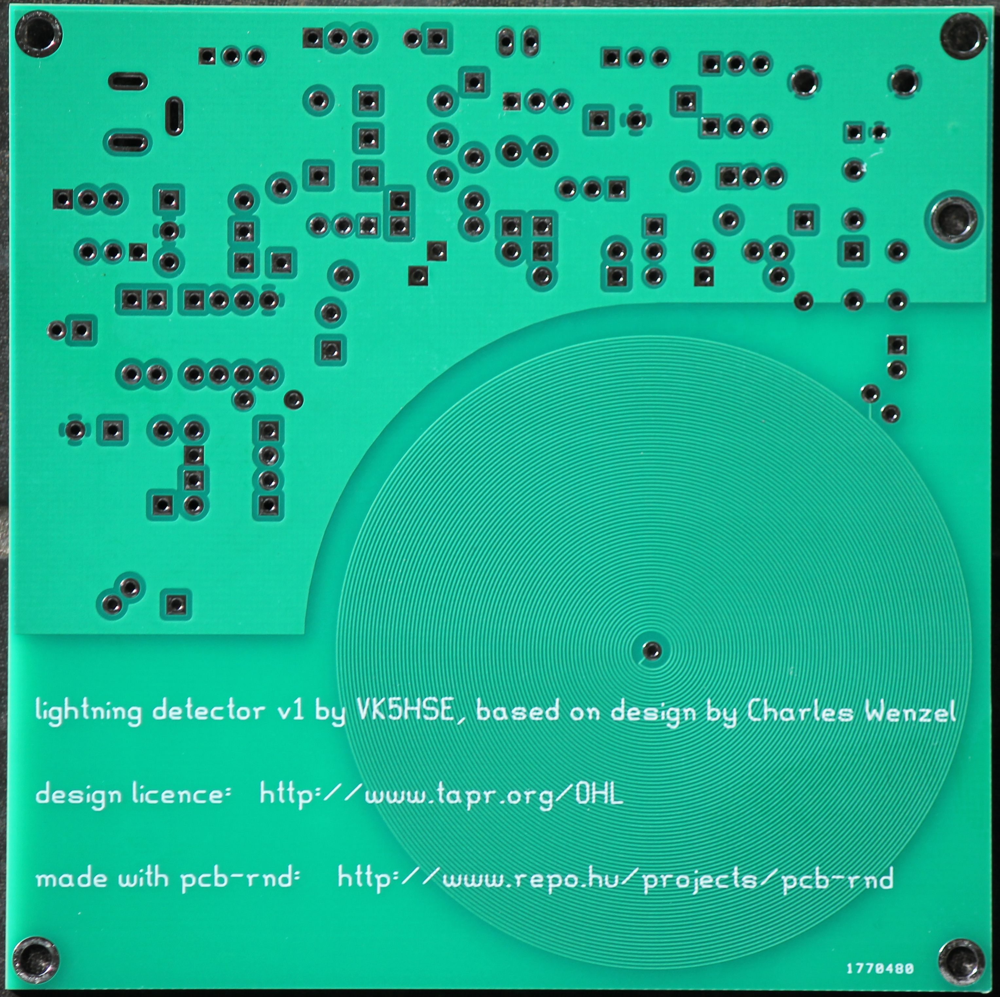
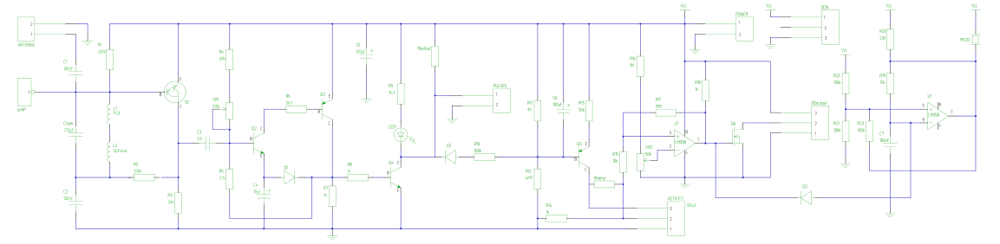

# erichVK5-lightning-detector
An open hardware lightning detector based on Charles Wenzel's design, as published in the Radio Society of Great Britain's Radcom magazine in 2023.

A project that is ideal for STEM in the classroom or amateur radio club projects.

The design is licensed under the TAPR open hardware license (https://tapr.org/the-tapr-open-hardware-license/)

Here is a top view of the prototype PCB (v1.1 fixes a few silk screen errors)

Here is a bottom view of the prototype PCB

This repository includes the PCB layout file in pcb-rnd format (.rp), as well as the schematic in sch-rnd format (.rs), for those who wish to modify the design further; see www.repo.hu/projects/pcb-rnd and www.repo.hu/projects/sch-rnd.

Builders can decide how many stages of the detector they wish to build.

Gerbers are in the zip files, and can be ordered from the usual online suppliers. Gerbers can be viewed in the camv-rnd gerber/CAM file viewer (see www.repo.hu/projects/camv-rnd), another part of the free and open source Ringdove electronic design software suite. The updated gerbers in vk5hse-lightning-detector-v1-1.zip fix a few minor silkscreen errors.

# Bill of materials

- BNC antenna connector (optional)
- 2.1mm DC power jack
- Telescopic antenna compatible with 3.1mm PCB mounting hole (optional)
- Piezo PCB speaker (PCB supports both 5mm and 6.35mm pinouts)

- R1, R2, 330k
- R3, R13 5k6
- R4 68k
- R5 27k
- R6 3k3
- R7, R8, R14, R18 1k
- R9 3k3
- R10, R21, R22, R23 100k
- R11, R16 1M
- R12 4M7
- R15 10k
- R17 10M
- R20 22k
- R19 12k
- VR1 100k
- VR2 50k
- Meter1 100uA moving coil meter
- C1, C2, C7 100nF
- Ctank 270pF
- C3 1nF
- C4 10uF
- C5, C6 100uF
- L2 external coil (optional)

- U1 LM358
- D1 5mm LED
- D2,D3 signal diode, 1N4148 or similar
- Q1 PNP darligton transistor
- Q1a, Q1b, discrete PNP signal transistors instead of Q1
- Q3, Q5, signal PNP transistors
- Q2, Q4, signal NPN transistors
- Q6 suitably rated N-Channel MOSFET

